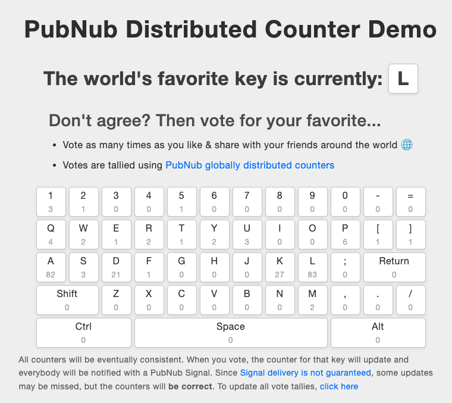

# Distributed Counter Demo

> Application to demonstrate the [PubNub distributed counters](https://www.pubnub.com/docs/serverless/functions/functions-apis/kvstore-module#counters), part of the KV Store module, accessible through PubNub Functions.

## Demo

A hosted version of this demo can be found at [https://distributed-counter.netlify.app/](https://distributed-counter.netlify.app/)



### Requirements
- [PubNub Account](#pubnub-account) (*Free*)

<a href="https://dashboard.pubnub.com/signup">
	
</a>

### Get Your PubNub Keys

1. You’ll first need to sign up for a [PubNub account](https://dashboard.pubnub.com/signup/). Once you sign up, you can get your unique PubNub keys from the [PubNub Developer Portal](https://admin.pubnub.com/).

1. Sign in to your [PubNub Dashboard](https://admin.pubnub.com/).

1. Click Apps, then **Create New App**.

1. Give your app a name, and click **Create**.

1. Click your new app to open its settings, then click its keyset.

1. Enable the Stream Controller feature for your keyset (it should already be enabled).

1. Copy the Publish and Subscribe keys and copy them into the `keys.js` file.

1. **Create the PubNub Function**, as detailed below

## PubNub Function Code and Configuration

A PubNub Function is required as follows:

- Name: [You choose]
- Event: `After Signal`
- Channel: `functionsdemo-counter-vote`

```javascript
const pubnub = require('pubnub');
const db = require("kvstore");

export default (request) => {
    var keysbatch1 = ["49", "50", "51", "52", "53", "54", "55", "56", "57", "48"]
    var keysbatch2 = ["189", "187", "81", "87", "69", "82", "84", "89", "85", "73"]
    var keysbatch3 = ["79", "80", "219", "221", "65", "83", "68", "70", "71", "72"]
    var keysbatch4 = ["74", "75", "76", "186", "13", "16", "90", "88", "67", "86"]
    var keysbatch5 = ["66", "78", "77", "188", "190", "191", "17", "32", "18"]
    if (request.message.keypress)
    {
        //  Somebody has pressed a key (voted).  Notify everybody else
        db.getCounter(request.message.keypress).then((counter) => {
            pubnub.signal({
                "channel": "functionsdemo-counter-result",
                "message": {"k":request.message.keypress, "c":++counter}
            }).then((signalResponse) => {
                //  Signal Sent
            });
        });
        //  And increment the counter
        db.incrCounter(request.message.keypress, 1);
    }
    else
    {
        //  A new client has requested the initial state of all counters
        //  We can only do 10 KV counter lookups per invocation of 
        //  functions, so return in batches
        var batch = keysbatch1
        if (request.message.batch == 2) {batch = keysbatch2}
        if (request.message.batch == 3) {batch = keysbatch3}
        if (request.message.batch == 4) {batch = keysbatch4}
        if (request.message.batch == 5) {batch = keysbatch5}
        batch.forEach((keyElement) => {
            db.getCounter(keyElement).then(function(counter) {
                if (counter > 0)
                {
                    pubnub.publish({
                        "channel": "functionsdemo-counter-result",
                        "message": {"k":keyElement, "c":counter}
                    }).then((messageResponse) => {
                        //  Message Sent
                    });
                }
            });

        }); 
    }
    return request.ok();
};
```

### Building and Running

1. After adding your Pub/Sub keys to `keys.js`, you can just launch index.html in any browser

## Contributing
Please fork the repository if you'd like to contribute. Pull requests are always welcome. 

## Further Information

- [PubNub distributed counters documentation](https://www.pubnub.com/docs/serverless/functions/functions-apis/kvstore-module#counters)
